##  Real-Time Write to WebBrowser showing WCF REST API page, using HttpContent.Response, from C# REPL Script 

In this post I will show a powerful technique for **_ASP.NET_** Debugging/Programming, where the [Web C# REPL that I recently added to TeamMentor](http://blog.diniscruz.com/2013/02/using-csharp-web-repl-from-teammentor.html#more) is triggered from a **_WCF REST API_**, in such a way that the **_HttpContext _**can be programmed in real-time, with the added bonus that the**_ HttpContext.Response OutputStream_** stays open (and can be written to multiple times).

It all starts with a new [TeamMentor ](http://teammentor.net/)REST API method called **_'/admin/scripts/{name}'_** :

[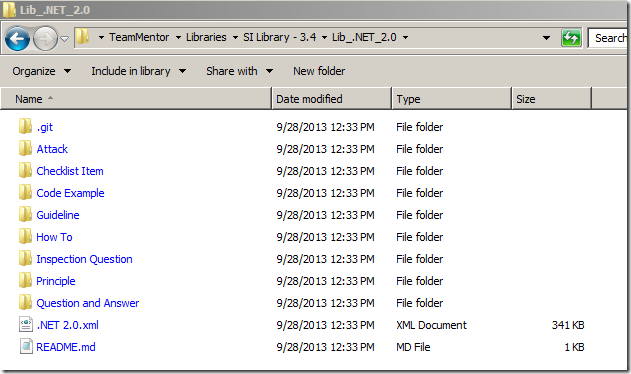](http://lh4.ggpht.com/-L5vRQtkktGU/UQxLgsSFZaI/AAAAAAAAIyY/_mn5lh7ngTs/s1600-h/image%25255B8%25255D.png)

which is powered by:

[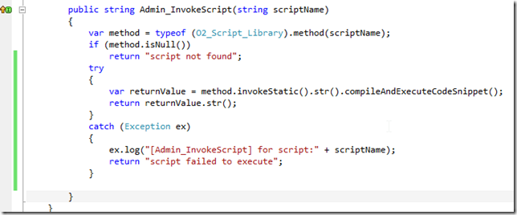](http://lh5.ggpht.com/-0kjgHsqmJXs/UQxLkFOwVkI/AAAAAAAAIzM/HS1RGCGwU7A/s1600-h/image%25255B5%25255D.png)

and is basically a reflection engine to compile and invoke the strings returned by this class:

[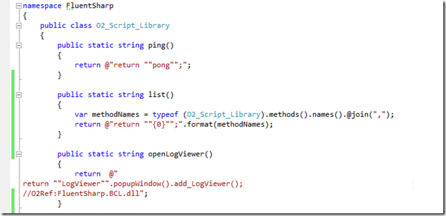](http://lh3.ggpht.com/-FqDKdHODFe8/UQxLnLvWSoI/AAAAAAAAI0E/1akSiSON6XU/s1600-h/image%25255B15%25255D.png)

This means that in practice:

The **_/admin/scripts/ping_** REST call will return the execution result of the string provided by _**O2_Script_Library.ping()** _method:

The **_/admin/scripts/list _**REST call will return the execution result of the string provided by _**O2_Script_Library.list()** _method:

[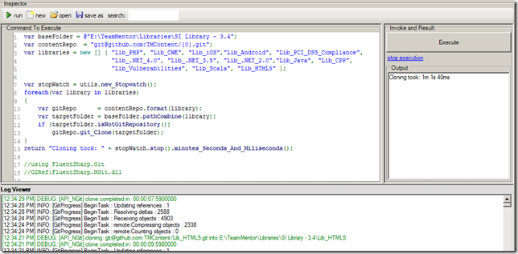](http://lh4.ggpht.com/-HE-dmOo6GCw/UQxLsHPHt4I/AAAAAAAAI04/UTqEZsJAR0I/s1600-h/image%25255B2%25255D.png)

The **_/admin/scripts/openLogVewer _**REST call will return the execution result of the string provided by _**O2_Script_Library.openLogViewer()** _method:

[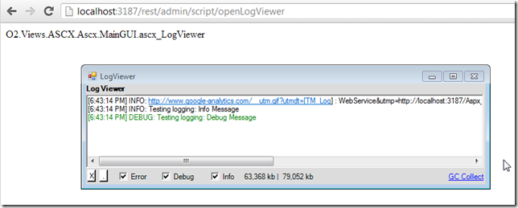](http://lh4.ggpht.com/-mQKrEPEOOYY/UQxLt8aslhI/AAAAAAAAI1M/s7ZjeKKhn3U/s1600-h/image%25255B24%25255D.png)

Note that in screenshot above, the LogViewer is a .NET WinForms created by the Cassini Process (the one hosting the **_WCF REST API_**).  
**  
**The really interesting script/method, is the _**O2_Script_Library.script_Me()** **:**_

[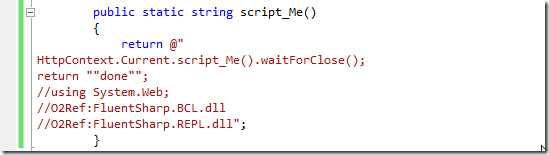](http://lh6.ggpht.com/-1BTokmkKa84/UQxLvVcgd5I/AAAAAAAAI1Y/B1FF_VKJR-4/s1600-h/image%25255B30%25255D.png)

This script, when invoked via the **_/admin/scripts/script_Me _**REST call, will provide a C# REPL environment, with a live **_HttpContext _**object available as a programmable variable :)

[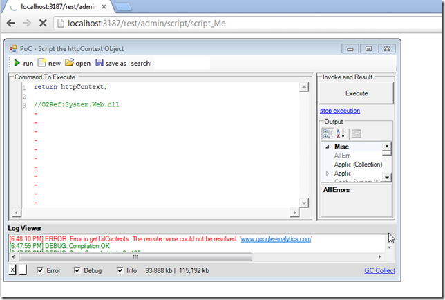](http://lh6.ggpht.com/-l3jM0ytzOww/UQxLw0auwaI/AAAAAAAAI1k/R06JvJlV3rM/s1600-h/image%25255B33%25255D.png)

Even better, because of the use of **_.waitForClose()_** in the **_httpContext.Current.script_Me().waitForClose() _**command, we can write in real-time to the browser (ie. the **_HttpContext.Response_** **_OutputStream _**is still alive)

[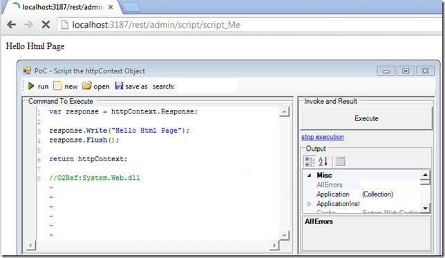](http://lh4.ggpht.com/-elf63e875jA/UQxLyuiFClI/AAAAAAAAI18/mwN2ICwbLdA/s1600-h/image%25255B36%25255D.png)

This means that we have a nice REPL environment, from C# into a web browser:

[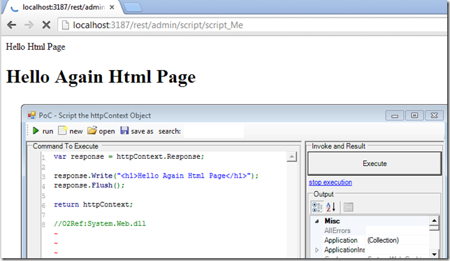](http://lh3.ggpht.com/-9Y7Am8SmqW8/UQxL0WyB8gI/AAAAAAAAI2M/K5zC0Nwb3qM/s1600-h/image%25255B39%25255D.png)

And in the C# REPL we have full access to all the C# programming techniques, like for example a for-loop

[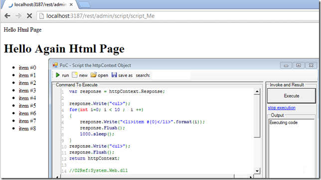](http://lh3.ggpht.com/-NIxsmHzzXsc/UQxL3PUyP7I/AAAAAAAAI2Y/SE--Qh-Cv8g/s1600-h/image%25255B42%25255D.png)

What I really like about this technique, is that it is going to allow me to write custom monitoring and debugging scripts in C# that interact with the target webpage :)

Interestingly the browser will keep the connection open for quite a while, which give us plenty of time to write and debug scripts.

Finally, to release the browser connection, use **_Response.End()_** :

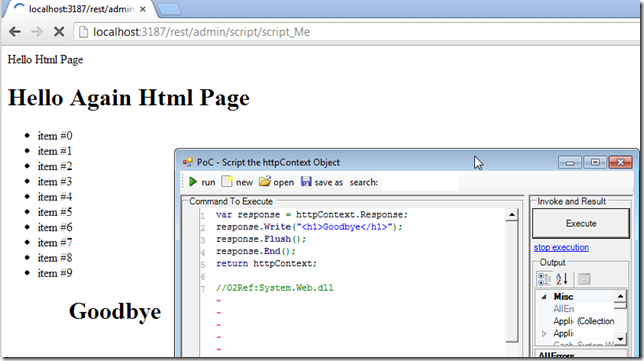

**Similar Techniques:**

  * [Manipulating Asp.NET Session Variables (from the server)](http://blog.diniscruz.com/2013/02/manipulating-aspnet-session-variables.html) 
  * [Using CSharp Web REPL from TeamMentor Control Panel](http://blog.diniscruz.com/2013/02/using-csharp-web-repl-from-teammentor.html) 
  * [Web-based C# REPL](http://blog.diniscruz.com/2012/10/web-based-c-repl-key-milestone-in-o2s.html)
